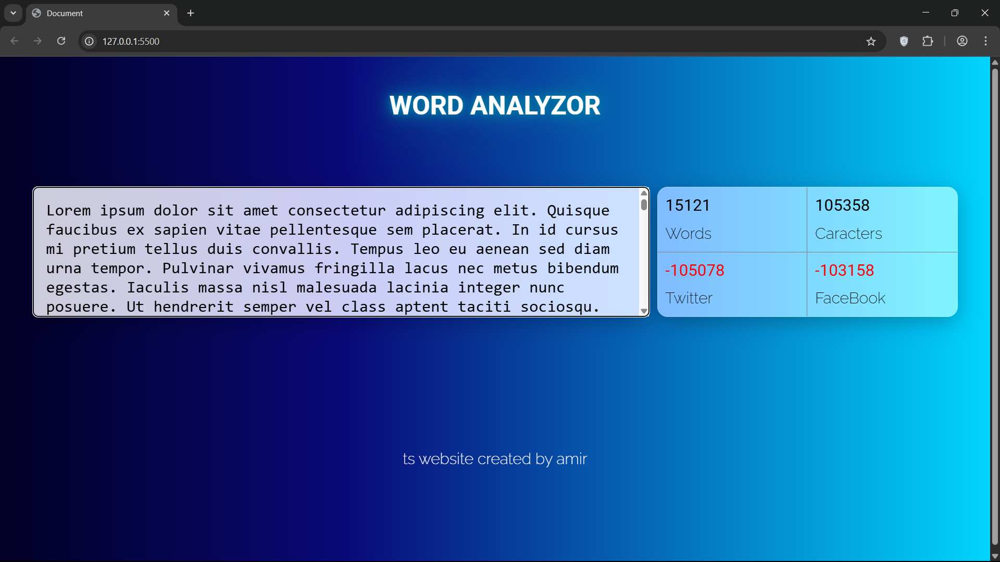

### 📝 WordCounter

A simple and efficient web application that counts **words**, **characters**, and **sentences** instantly as you type.  
Perfect for writers, developers, and students who want to track their text statistics in real-time.

---

### 🚀 Features
- ⚡ Real-time word and character counting  
- ✍️ Live text area with instant updates  
- 📊 Displays total sentences and paragraphs  
- 📱 Fully responsive design  
- 🎨 Clean and minimal UI  

---

### 🖼️ Screenshot
<p align="center">
  
</p>

---

### ⚙️ Installation & Run

```bash
git clone https://github.com/VibelessYoung/WordCounter.git
cd WordCounter
